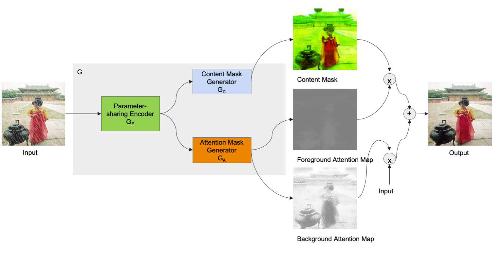
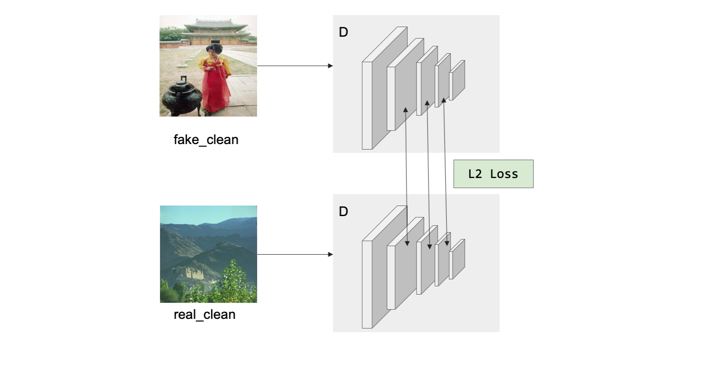
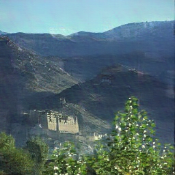

# derain_attentionGAN
- single image deraining with attentionGAN
  - 论文链接：https://link.springer.com/article/10.1007/s11760-021-01972-9

- model architeture

- Generator

- Discriminator

- InterFeat loss

- test1 img

- test2 img

